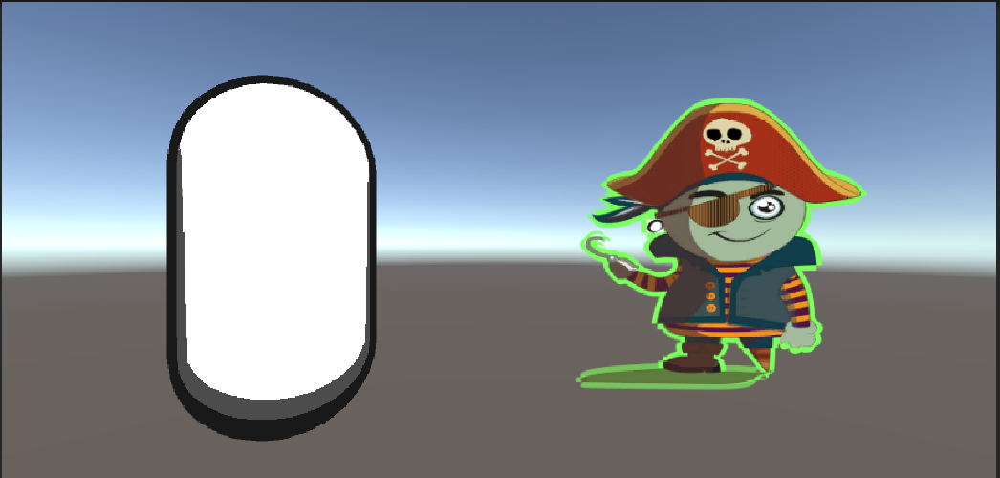

# 輪郭
今回の輪郭抽出を発展させてかっこいい輪郭を作ってください
* 輪郭の太さをかっこよく部分的に変える
* ポストエフェクトで作成
* 素敵な色を付ける
* などなど

# 自分なりに変更した点

-輪郭の色を変更しました。（右側）

-オブジェクトの影にも輪郭を付けトゥーンシェーダーっぽくしました（左側）
-

# 進め方

- 本リポジトリをフォークしてください
- フォークしたリポジトリをcloneします
- Unityのプロジェクトを更新して実装してください。
- このテキストファイルに変更点を記載してください
- result.gifを自分の結果を保存して差し替えてください
- プルリクエストを出して提出してください
